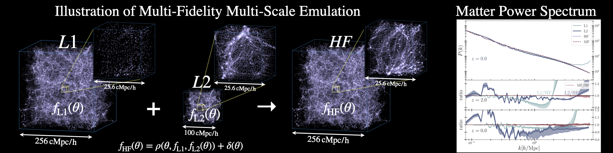

# MF-Box: Multi-fidelity and multi-scale emulation for the matter power spectrum using Gaussian processes



The code is derived from the multi-fidelity emulator code reported in

> MF-Box: Multi-fidelity and multi-scale emulation for the matter power spectrum
> [astro-ph.CO: 2306.03144](https://arxiv.org/abs/2306.03144)
>
> Ming-Feng Ho, Simeon Bird, Martin A. Fernandez, Christian R. Shelton

Acknowledgement: We thank Dr Simon Mak and Irene Ji from https://arxiv.org/abs/2108.00306 for providing the code for deep graphical GP model.

## Example notebook: using GPy

The tutorial notebook in [`notebooks/Build 60L1-60L2-3HR Multi-Fidelity Multi-Scale Emulator for Matter Power Spectrum.ipynb`](https://nbviewer.org/github/jibanCat/matter_emu_mfbox/blob/public/notebooks/Build%2060L1-60L2-3HR%20Multi-Fidelity%20Multi-Scale%20Emulator%20for%20Matter%20Power%20Spectrum.ipynb)
provides guidance for how to use the multi-fidelity emulator, MF-Box.


## Example script

First, download data from another repo:

```bash
git clone https://github.com/jibanCat/MFBoxData.git
# copy the simulated power spectra to this folder
cp -r MFBoxData/data .
```

All the data should be in `data/` folder.

Run the example script:

```bash
python -u -c "from examples.optimize_mfemulator import *;\
optimize_mfemulator(\
lf_filename='data/dmo_60_res128box256/cc_emulator_powerspecs.hdf5',\
hf_filename='data/dmo_24_res512box256/cc_emulator_powerspecs.hdf5',\
test_filename='data/dmo_10_res512box256/cc_emulator_powerspecs.hdf5',\
lf_json='data/dmo_60_res128box256//emulator_params.json',\
hf_json='data/dmo_24_res512box256/emulator_params.json',\
test_json='data/dmo_10_res512box256/emulator_params.json',\
max_z=3.0, min_z=0.0,\
n_optimization_restarts=20,\
parallel=False,\
dGMGP=True,\
lf_filename_2='data/dmo_60_res128box100/cc_emulator_powerspecs.hdf5',\
lf_json_2='data/dmo_60_res128box100/emulator_params.json',\
num_lf=60,\
num_lf_2=60,\
hf_selected_ind=[57, 58, 59], )"
```

The above line runs multi-fidelity emulator (MF-Box) using 60 L1 (`dmo_60_res128box256`) and 60 L2 (`dmo_24_res512box256`) and 3 HF (`dmo_24_res512box256`). Validate on 10 test simulations (`dmo_10_res512box256`).

Some useful args are:

1. `num_lf`: number of L1 used in emulation.
2. `num_lf_2`: number of L2 used in emulation.
3. `hf_selected_ind`: the selected index for HF used for training multi-fidelity emulator.
4. `max_z=3.0, min_z=0.0`: min and max of the redshift ranges.

Requirements:

- Python 3.6+
- numpy
- scipy
- GPy
- pyDOE
- emukit

Email me if there's any issue about versions: mho026-at-ucr.edu

## Example notebook: Tensorflow Probability implementation

In [`notebooks/14_MFBox_tensorflow.ipynb`](https://nbviewer.org/github/jibanCat/matter_emu_mfbox/blob/public/notebooks/14_MFBox_tensorflow.ipynb), I rewrite the GPy implementation of multi-fidelity emulator in Tensorflow Probability.
The basis is the NARGP model (Non-linear AutoRegressive Gaussian Process).
You can also find my implementation of NARGP in Tensorflow in https://github.com/jibanCat/nargp_tensorflow, which has more detailed comments than the version I had here.
Academic life does not give me time to make it user-friendly and make it a module.
If you have questions on using it, please contact me at anytime (mho026 at ucr.edu).


The Tensorflow version runs faster but requires some fine-tuning on the hyperparameter prior to get the best emulation accuracy.

## Where did I get the simulations?

Simulations are run with [MP-Gadget code](https://github.com/MP-Gadget/MP-Gadget/).

A simulation submission file generator is here: github.com/jibanCat/SimulationRunnerDM.
I used this generator to prepare the training/testing data in this repo.
